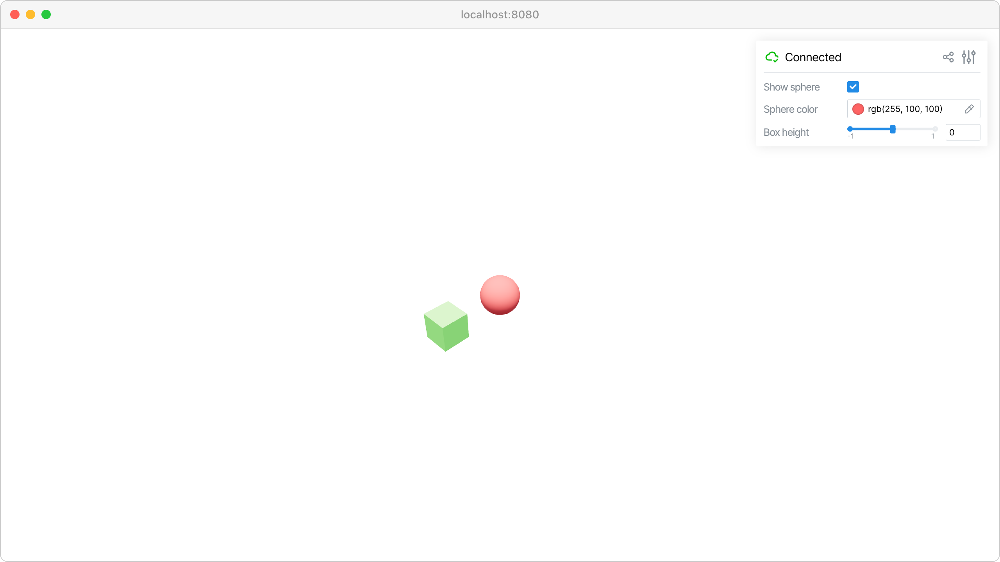

Core concepts
=============

Creating a server, adding 3D objects to the scene, and building interactive GUI controls.

We start by creating a :class:`viser.ViserServer` instance, which automatically
opens a web interface at http://localhost:8080. The server provides two main
APIs:

- **Scene API** (:attr:`viser.ViserServer.scene`): Add 3D objects like meshes, point clouds, and primitive shapes using methods like :meth:`viser.SceneApi.add_icosphere` and :meth:`viser.SceneApi.add_box`.
- **GUI API** (:attr:`viser.ViserServer.gui`): Create interactive controls like sliders, buttons, and color pickers using methods like :meth:`viser.GuiApi.add_slider` and :meth:`viser.GuiApi.add_rgb`.

**Source:** ``examples/00_getting_started/01_core_concepts.py``

Code
----

.. code-block:: python
   :linenos:

   import time
   
   import viser
   
   
   def main():
       server = viser.ViserServer()
   
       # Add 3D objects to the scene
       sphere = server.scene.add_icosphere(
           name="/sphere",
           radius=0.3,
           color=(255, 100, 100),
           position=(0.0, 0.0, 0.0),
       )
       box = server.scene.add_box(
           name="/box",
           dimensions=(0.4, 0.4, 0.4),
           color=(100, 255, 100),
           position=(1.0, 0.0, 0.0),
       )
   
       # Create GUI controls
       sphere_visible = server.gui.add_checkbox("Show sphere", initial_value=True)
       sphere_color = server.gui.add_rgb("Sphere color", initial_value=(255, 100, 100))
       box_height = server.gui.add_slider(
           "Box height", min=-1.0, max=1.0, step=0.1, initial_value=0.0
       )
   
       # Connect GUI controls to scene objects
       @sphere_visible.on_update
       def _(_):
           sphere.visible = sphere_visible.value
   
       @sphere_color.on_update
       def _(_):
           sphere.color = sphere_color.value
   
       @box_height.on_update
       def _(_):
           box.position = (1.0, 0.0, box_height.value)
   
       print("Server running")
       while True:
           time.sleep(10.0)
   
   
   if __name__ == "__main__":
       main()
   
