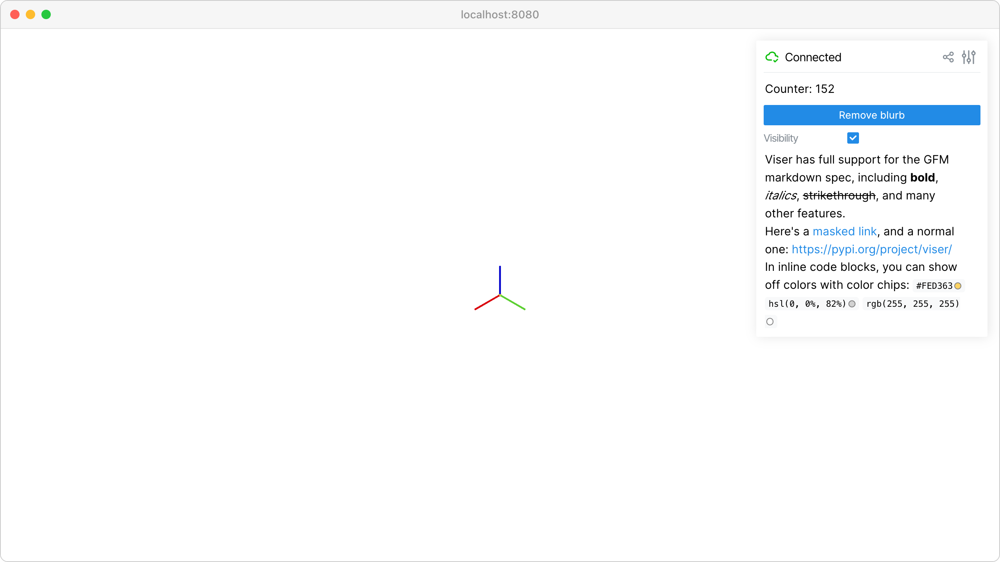

Markdown support
================

Display rich text content with markdown support.

Display rich text content with markdown support in GUI panels.

**Features:**

* :meth:`viser.GuiApi.add_markdown` for markdown content
* :meth:`viser.GuiApi.add_html` for raw HTML content
* :meth:`viser.GuiApi.add_image` for displaying images
* Dynamic content updates and relative image paths

**Source:** ``examples/02_gui/03_markdown.py``

Code
----

.. code-block:: python
   :linenos:

   import time
   from pathlib import Path
   
   import viser
   
   server = viser.ViserServer()
   server.scene.world_axes.visible = True
   
   markdown_counter = server.gui.add_markdown("Counter: 0")
   
   here = Path(__file__).absolute().parent
   
   button = server.gui.add_button("Remove blurb")
   checkbox = server.gui.add_checkbox("Visibility", initial_value=True)
   
   markdown_source = """
   Viser has full support for the GFM markdown spec, including **bold**, _italics_,
   ~~strikethrough~~, and many other features.
   
   Here's a [masked link](https://github.com/nerfstudio-project/viser), and a
   normal one: https://pypi.org/project/viser/
   
   In inline code blocks, you can show off colors with color chips: `#FED363`
   `hsl(0, 0%, 82%)` `rgb(255, 255, 255)`
