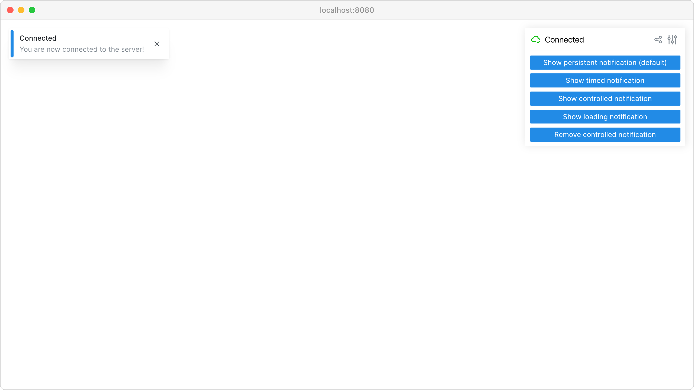

Notifications
=============

Display different types of notifications to users including persistent, timed, and loading indicators.

**Features:**

* :meth:`viser.ClientHandle.add_notification` for user alerts
* Persistent notifications that stay until dismissed
* Timed notifications with automatic removal
* Loading notifications with progress indication
* Per-client notification management

**Source:** ``examples/02_gui/06_notifications.py``

Code
----

.. code-block:: python
   :linenos:

   import time
   
   import viser
   
   
   def main() -> None:
       server = viser.ViserServer()
   
       persistent_notif_button = server.gui.add_button(
           "Show persistent notification (default)"
       )
       timed_notif_button = server.gui.add_button("Show timed notification")
       controlled_notif_button = server.gui.add_button("Show controlled notification")
       loading_notif_button = server.gui.add_button("Show loading notification")
   
       remove_controlled_notif = server.gui.add_button("Remove controlled notification")
   
       @persistent_notif_button.on_click
       def _(event: viser.GuiEvent) -> None:
           client = event.client
           assert client is not None
   
           client.add_notification(
               title="Persistent notification",
               body="This can be closed manually and does not disappear on its own!",
               with_close_button=True,
           )
   
       @timed_notif_button.on_click
       def _(event: viser.GuiEvent) -> None:
           client = event.client
           assert client is not None
   
           client.add_notification(
               title="Timed notification",
               body="This disappears automatically after 5 seconds!",
               auto_close_seconds=5.0,
           )
   
       @controlled_notif_button.on_click
       def _(event: viser.GuiEvent) -> None:
           client = event.client
           assert client is not None
   
           controlled_notif = client.add_notification(
               title="Controlled notification",
               body="This cannot be closed by the user and is controlled in code only!",
               with_close_button=False,
               auto_close_seconds=False,
           )
   
           @remove_controlled_notif.on_click
           def _(_) -> None:
               controlled_notif.remove()
   
       @loading_notif_button.on_click
       def _(event: viser.GuiEvent) -> None:
           client = event.client
           assert client is not None
   
           loading_notif = client.add_notification(
               title="Loading notification",
               body="This indicates that some action is in progress! It will be updated in 3 seconds.",
               loading=True,
               with_close_button=False,
           )
           time.sleep(3.0)
   
           loading_notif.title = "Updated notification"
           loading_notif.body = "This notification has been updated!"
           loading_notif.loading = False
           loading_notif.with_close_button = True
           loading_notif.auto_close_seconds = 5.0
           loading_notif.color = "green"
   
       @server.on_client_connect
       def _(client: viser.ClientHandle) -> None:
           client.add_notification(
               "Connected",
               "You are now connected to the server!",
               auto_close_seconds=30.0,
           )
   
       while True:
           time.sleep(1.0)
   
   
   if __name__ == "__main__":
       main()
   
