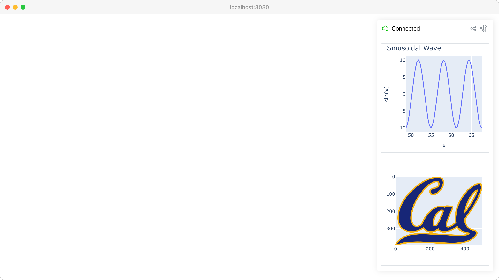

Plotly integration
==================

Embed interactive Plotly charts and graphs directly in the GUI interface.

**Features:**

* :meth:`viser.GuiApi.add_plotly` for embedding Plotly figures
* Real-time chart updates with dynamic data
* Interactive charts with zoom, pan, and hover
* Multiple chart types (line plots, 3D surfaces, heatmaps)

**Source:** ``examples/02_gui/07_plotly_integration.py``

Code
----

.. code-block:: python
   :linenos:

   import time
   
   import numpy as np
   import plotly.express as px
   import plotly.graph_objects as go
   from PIL import Image
   
   import viser
   
   
   def create_sinusoidal_wave(t: float) -> go.Figure:
       x_data = np.linspace(t, t + 6 * np.pi, 50)
       y_data = np.sin(x_data) * 10
   
       fig = px.line(
           x=list(x_data),
           y=list(y_data),
           labels={"x": "x", "y": "sin(x)"},
           title="Sinusoidal Wave",
       )
   
       # this sets the margins to be tight around the title.
       fig.layout.title.automargin = True  # type: ignore
       fig.update_layout(
           margin=dict(l=20, r=20, t=20, b=20),
       )  # Reduce plot margins.
   
       return fig
   
   
   def main() -> None:
       server = viser.ViserServer()
   
       # Plot type 1: Line plot.
       line_plot_time = 0.0
       line_plot = server.gui.add_plotly(figure=create_sinusoidal_wave(line_plot_time))
   
       # Plot type 2: Image plot.
       # Use Path to handle relative paths correctly from any working directory
       from pathlib import Path
   
       assets_dir = Path(__file__).parent.parent / "assets"
       fig = px.imshow(Image.open(assets_dir / "Cal_logo.png"))
       fig.update_layout(
           margin=dict(l=20, r=20, t=20, b=20),
       )
       server.gui.add_plotly(figure=fig, aspect=1.0)
   
       # Plot type 3: 3D Scatter plot.
       fig = px.scatter_3d(
           px.data.iris(),
           x="sepal_length",
           y="sepal_width",
           z="petal_width",
           color="species",
       )
       fig.update_layout(legend=dict(yanchor="top", y=0.99, xanchor="left", x=0.01))
       fig.update_layout(
           margin=dict(l=20, r=20, t=20, b=20),
       )
       server.gui.add_plotly(figure=fig, aspect=1.0)
   
       while True:
           # Update the line plot.
           line_plot_time += 0.1
           line_plot.figure = create_sinusoidal_wave(line_plot_time)
   
           time.sleep(0.01)
   
   
   if __name__ == "__main__":
       main()
   
