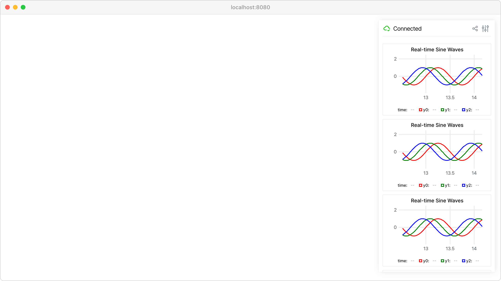

uPlot integration
=================

Embed lightweight, fast uPlot charts directly in the GUI interface.

This example demonstrates real-time data visualization using :meth:`viser.GuiApi.add_uplot` with multiple animated sine wave plots. uPlot provides efficient rendering for time-series data with smooth 60fps updates.

**Features demonstrated:**

* Multiple synchronized plots with :class:`viser.uplot.Series` configuration
* Real-time data streaming and chart updates
* Custom scales and styling options
* Legend display with :class:`viser.uplot.Legend`

**Source:** ``examples/02_gui/08_uplot.py``

Code
----

.. code-block:: python
   :linenos:

   from __future__ import annotations
   
   import time
   
   import numpy as np
   import tyro
   import viser
   import viser.uplot
   
   
   def y(x: np.ndarray, offset: float) -> np.ndarray:
       return np.sin(2 * np.pi * x + offset)
   
   
   def main(num_plots: int = 5, num_timesteps: int = 100, num_lines: int = 3) -> None:
       server = viser.ViserServer()
       time_step = 1.0 / 60.0
   
       # Data for uPlot: tuple of arrays where first is x-data, rest are y-data.
       x_data = time_step * np.arange(num_timesteps, dtype=np.float64)
       data = (x_data, *[y(x_data, i) for i in range(num_lines)])
       print("Data shapes:", [arr.shape for arr in data])
   
       uplot_handles: list[viser.GuiUplotHandle] = []
       for _ in range(num_plots):
           uplot_handles.append(
               server.gui.add_uplot(
                   data=data,
                   series=(
                       viser.uplot.Series(label="time"),
                       *[
                           viser.uplot.Series(
                               label=f"y{i}",
                               stroke=["red", "green", "blue"][i % 3],
                               width=2,
                           )
                           for i in range(num_lines)
                       ],
                   ),
                   title="Real-time Sine Waves",
                   scales={
                       "x": viser.uplot.Scale(
                           time=False,
                           auto=True,
                       ),
                       "y": viser.uplot.Scale(range=(-1.5, 2.5)),
                   },
                   legend=viser.uplot.Legend(show=True),
                   aspect=2.0,
               )
           )
   
       while True:
           # Update the line plot.
           x_data = x_data + time_step
           for uplot_handle in uplot_handles:
               uplot_handle.data = (x_data, *[y(x_data, i) for i in range(num_lines)])
           time.sleep(time_step)
   
   
   if __name__ == "__main__":
       tyro.cli(main)
   
