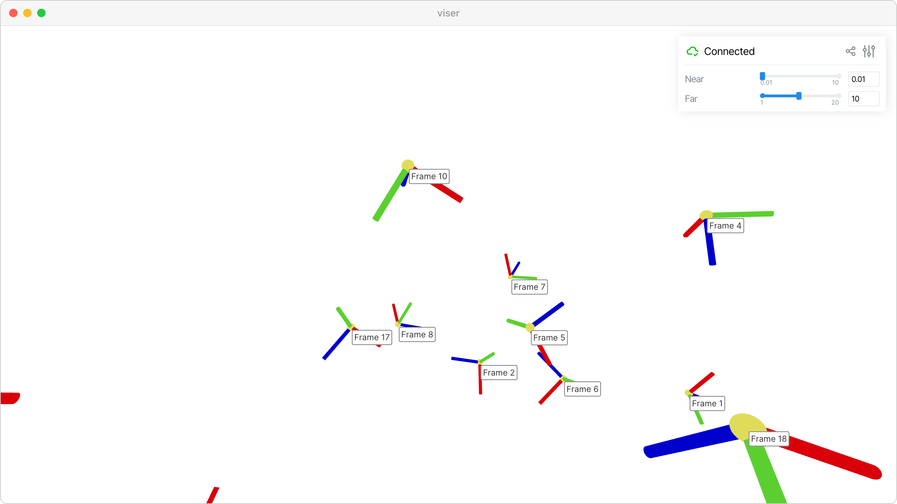

Programmatic camera control
===========================

Control camera position, orientation, and parameters programmatically.

This example demonstrates how to programmatically control client cameras, including smooth animated transitions between viewpoints. Camera control is essential for guided tours, automatic viewpoint switching, or creating cinematic presentations of 3D content.

**Key features:**

* :attr:`viser.CameraHandle.wxyz` and :attr:`viser.CameraHandle.position` for setting camera pose
* :attr:`viser.CameraHandle.near` and :attr:`viser.CameraHandle.far` for clipping plane control
* :attr:`viser.CameraHandle.look_at` for orbit center positioning
* :meth:`viser.ViserServer.atomic` for synchronized camera updates
* Smooth interpolation using SE(3) transformations

The example shows how to create clickable frames that smoothly animate the camera to different viewpoints, and how to use atomic updates to prevent visual artifacts during camera transitions.

**Source:** ``examples/03_interaction/04_camera_commands.py``

Code
----

.. code-block:: python
   :linenos:

   import time
   
   import numpy as np
   
   import viser
   import viser.transforms as tf
   
   server = viser.ViserServer()
   num_frames = 20
   
   
   @server.on_client_connect
   def _(client: viser.ClientHandle) -> None:
   
       client.camera.far = 10.0
   
       near_slider = client.gui.add_slider(
           "Near", min=0.01, max=10.0, step=0.001, initial_value=client.camera.near
       )
       far_slider = client.gui.add_slider(
           "Far", min=1, max=20.0, step=0.001, initial_value=client.camera.far
       )
   
       @near_slider.on_update
       def _(_) -> None:
           client.camera.near = near_slider.value
   
       @far_slider.on_update
       def _(_) -> None:
           client.camera.far = far_slider.value
   
   
   @server.on_client_connect
   def _(client: viser.ClientHandle) -> None:
   
       rng = np.random.default_rng(0)
   
       def make_frame(i: int) -> None:
           # Sample a random orientation + position.
           wxyz = rng.normal(size=4)
           wxyz /= np.linalg.norm(wxyz)
           position = rng.uniform(-3.0, 3.0, size=(3,))
   
           # Create a coordinate frame and label.
           frame = client.scene.add_frame(f"/frame_{i}", wxyz=wxyz, position=position)
           client.scene.add_label(f"/frame_{i}/label", text=f"Frame {i}")
   
           # Move the camera when we click a frame.
           @frame.on_click
           def _(_):
               T_world_current = tf.SE3.from_rotation_and_translation(
                   tf.SO3(client.camera.wxyz), client.camera.position
               )
               T_world_target = tf.SE3.from_rotation_and_translation(
                   tf.SO3(frame.wxyz), frame.position
               ) @ tf.SE3.from_translation(np.array([0.0, 0.0, -0.5]))
   
               T_current_target = T_world_current.inverse() @ T_world_target
   
               for j in range(20):
                   T_world_set = T_world_current @ tf.SE3.exp(
                       T_current_target.log() * j / 19.0
                   )
   
                   # We can atomically set the orientation and the position of the camera
                   # together to prevent jitter that might happen if one was set before the
                   # other.
                   with client.atomic():
                       client.camera.wxyz = T_world_set.rotation().wxyz
                       client.camera.position = T_world_set.translation()
   
                   client.flush()  # Optional!
                   time.sleep(1.0 / 60.0)
   
               # Mouse interactions should orbit around the frame origin.
               client.camera.look_at = frame.position
   
       for i in range(num_frames):
           make_frame(i)
   
   
   while True:
       time.sleep(1.0)
   
