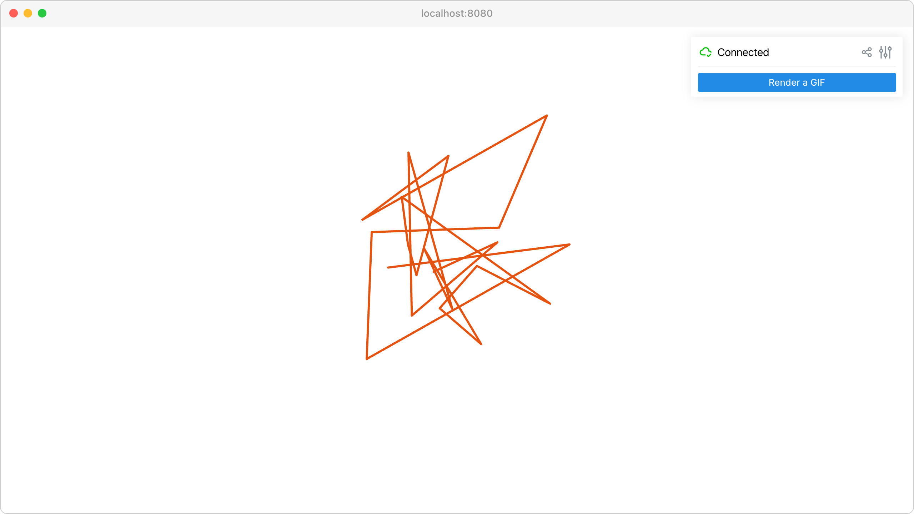

Get renders
===========

Capture rendered images from client viewports for processing or saving.

**Features:**

* :meth:`viser.ClientHandle.get_render` for viewport image capture
* Automatic image saving with imageio
* GUI controls for triggering captures
* Real-time viewport-to-image conversion

**Source:** ``examples/03_interaction/02_get_renders.py``

Code
----

.. code-block:: python
   :linenos:

   import time
   
   import imageio.v3 as iio
   import numpy as np
   
   import viser
   
   
   def main():
       server = viser.ViserServer()
   
       button = server.gui.add_button("Render a GIF")
   
       @button.on_click
       def _(event: viser.GuiEvent) -> None:
           client = event.client
           assert client is not None
   
           client.scene.reset()
   
           images = []
   
           for i in range(20):
               positions = np.random.normal(size=(30, 3))
               client.scene.add_spline_catmull_rom(
                   f"/catmull_{i}",
                   positions,
                   tension=0.5,
                   line_width=3.0,
                   color=np.random.uniform(size=3),
               )
               images.append(client.get_render(height=720, width=1280))
               print("Got image with shape", images[-1].shape)
   
           print("Generating and sending GIF...")
           client.send_file_download(
               "image.gif", iio.imwrite("<bytes>", images, extension=".gif", loop=0)
           )
           print("Done!")
   
       while True:
           time.sleep(10.0)
   
   
   if __name__ == "__main__":
       main()
   
