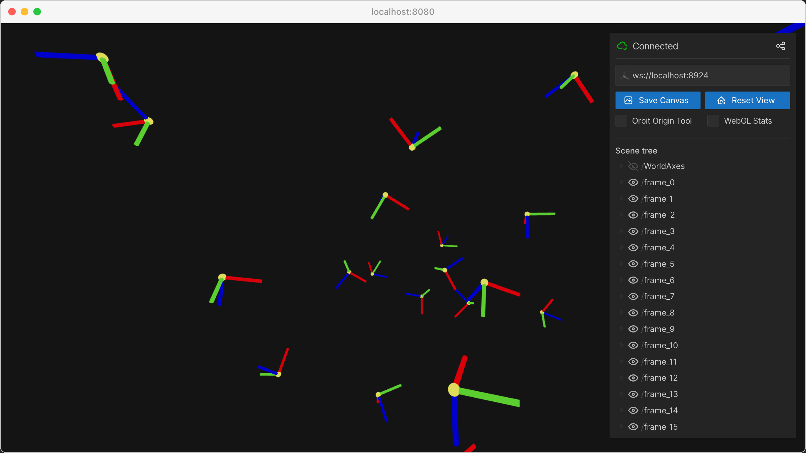

3D GUI elements
===============

Embed GUI controls directly in the 3D scene positioned relative to scene objects.

**Features:**

* :meth:`viser.SceneApi.add_3d_gui_container` for 3D-positioned GUI panels
* Click interactions with coordinate frame objects
* Context-sensitive controls attached to scene objects
* Dynamic GUI panel visibility and positioning

**Source:** ``examples/03_interaction/05_gui_in_scene.py``

Code
----

.. code-block:: python
   :linenos:

   from __future__ import annotations
   
   import time
   
   import numpy as np
   
   import viser
   import viser.transforms as tf
   
   server = viser.ViserServer()
   server.gui.configure_theme(dark_mode=True)
   num_frames = 20
   
   
   @server.on_client_connect
   def _(client: viser.ClientHandle) -> None:
   
       rng = np.random.default_rng(0)
   
       displayed_3d_container: viser.Gui3dContainerHandle | None = None
   
       def make_frame(i: int) -> None:
           # Sample a random orientation + position.
           wxyz = rng.normal(size=4)
           wxyz /= np.linalg.norm(wxyz)
           position = rng.uniform(-3.0, 3.0, size=(3,))
   
           # Create a coordinate frame and label.
           frame = client.scene.add_frame(f"/frame_{i}", wxyz=wxyz, position=position)
   
           # Move the camera when we click a frame.
           @frame.on_click
           def _(_):
               nonlocal displayed_3d_container
   
               # Close previously opened GUI.
               if displayed_3d_container is not None:
                   displayed_3d_container.remove()
   
               displayed_3d_container = client.scene.add_3d_gui_container(
                   f"/frame_{i}/gui"
               )
               with displayed_3d_container:
                   go_to = client.gui.add_button("Go to")
                   randomize_orientation = client.gui.add_button("Randomize orientation")
                   close = client.gui.add_button("Close GUI")
   
               @go_to.on_click
               def _(_) -> None:
                   T_world_current = tf.SE3.from_rotation_and_translation(
                       tf.SO3(client.camera.wxyz), client.camera.position
                   )
                   T_world_target = tf.SE3.from_rotation_and_translation(
                       tf.SO3(frame.wxyz), frame.position
                   ) @ tf.SE3.from_translation(np.array([0.0, 0.0, -0.5]))
   
                   T_current_target = T_world_current.inverse() @ T_world_target
   
                   for j in range(20):
                       T_world_set = T_world_current @ tf.SE3.exp(
                           T_current_target.log() * j / 19.0
                       )
   
                       # Important bit: we atomically set both the orientation and the position
                       # of the camera.
                       with client.atomic():
                           client.camera.wxyz = T_world_set.rotation().wxyz
                           client.camera.position = T_world_set.translation()
                       time.sleep(1.0 / 60.0)
   
                   # Mouse interactions should orbit around the frame origin.
                   client.camera.look_at = frame.position
   
               @randomize_orientation.on_click
               def _(_) -> None:
                   wxyz = rng.normal(size=4)
                   wxyz /= np.linalg.norm(wxyz)
                   frame.wxyz = wxyz
   
               @close.on_click
               def _(_) -> None:
                   nonlocal displayed_3d_container
                   if displayed_3d_container is None:
                       return
                   displayed_3d_container.remove()
                   displayed_3d_container = None
   
       for i in range(num_frames):
           make_frame(i)
   
   
   while True:
       time.sleep(1.0)
   
