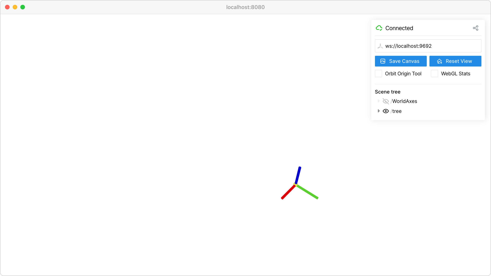

Coordinate frames
=================

Visualize 3D coordinate systems and hierarchical transformations.

This example demonstrates how to create and organize coordinate frames using :meth:`viser.SceneApi.add_frame`. Coordinate frames are essential for understanding spatial relationships in 3D scenes and are commonly used in robotics, computer graphics, and 3D reconstruction applications.

**Key concepts:**

- **Hierarchical naming**: Scene nodes follow a filesystem-like structure (``/tree/branch/leaf``)
- **Relative positioning**: Child frames are positioned relative to their parent frames
- **Dynamic scene management**: Frames can be added and removed during runtime with :meth:`viser.SceneNodeHandle.remove`

The hierarchical structure allows for complex transformations where moving a parent frame automatically moves all its children, making it perfect for modeling articulated objects, robot arms, or nested coordinate systems.

**Source:** ``examples/01_scene/00_coordinate_frames.py``

Code
----

.. code-block:: python
   :linenos:

   import random
   import time
   
   import viser
   
   server = viser.ViserServer()
   
   while True:
       # Add some coordinate frames to the scene. These will be visualized in the viewer.
       server.scene.add_frame(
           "/tree",
           wxyz=(1.0, 0.0, 0.0, 0.0),
           position=(random.random() * 2.0, 2.0, 0.2),
       )
       server.scene.add_frame(
           "/tree/branch",
           wxyz=(1.0, 0.0, 0.0, 0.0),
           position=(random.random() * 2.0, 2.0, 0.2),
       )
       leaf = server.scene.add_frame(
           "/tree/branch/leaf",
           wxyz=(1.0, 0.0, 0.0, 0.0),
           position=(random.random() * 2.0, 2.0, 0.2),
       )
       time.sleep(5.0)
   
       # Remove the leaf node from the scene.
       leaf.remove()
       time.sleep(0.5)
   
