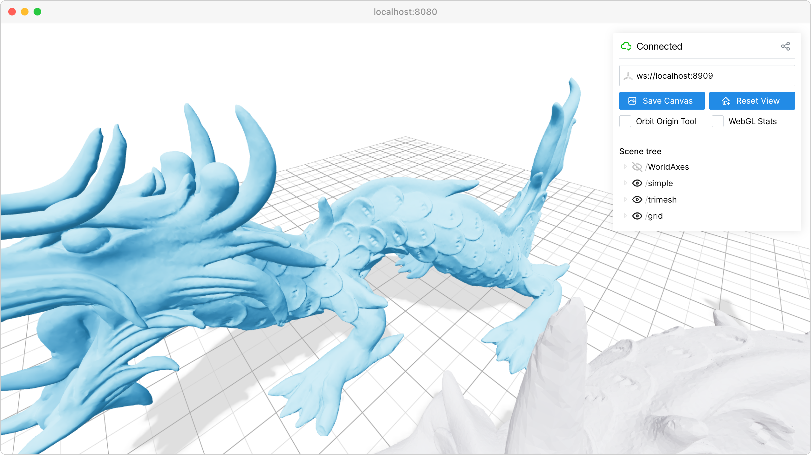

3D mesh visualization
=====================

Load and display 3D meshes from common file formats.

This example demonstrates how to load and visualize 3D meshes using viser's mesh rendering capabilities. Meshes are fundamental for displaying complex 3D geometry from CAD models, 3D scans, or generated content.

**Key features:**

* :meth:`viser.SceneApi.add_mesh_simple` for basic vertex/face arrays
* :meth:`viser.SceneApi.add_mesh_trimesh` for direct trimesh object integration
* :meth:`viser.SceneApi.add_grid` for reference grounding
* Mesh transformation using viser's transform utilities

The example shows two ways to display the same mesh: using raw vertices/faces arrays or directly from a trimesh object. This flexibility allows integration with various 3D processing pipelines and file formats supported by trimesh.

.. note::
    This example requires external assets. To download them, run:

    .. code-block:: bash

        git clone https://github.com/nerfstudio-project/viser.git
        cd viser/examples
        ./assets/download_assets.sh
        python 01_scene/02_meshes.py  # With viser installed.

**Source:** ``examples/01_scene/02_meshes.py``

Code
----

.. code-block:: python
   :linenos:

   import time
   from pathlib import Path
   
   import numpy as np
   import trimesh
   
   import viser
   import viser.transforms as tf
   
   
   def main():
       mesh = trimesh.load_mesh(str(Path(__file__).parent / "../assets/dragon.obj"))
       assert isinstance(mesh, trimesh.Trimesh)
       mesh.apply_scale(0.05)
   
       vertices = mesh.vertices
       faces = mesh.faces
       print(f"Loaded mesh with {vertices.shape} vertices, {faces.shape} faces")
   
       server = viser.ViserServer()
       server.scene.add_mesh_simple(
           "/simple",
           vertices=vertices,
           faces=faces,
           wxyz=tf.SO3.from_x_radians(np.pi / 2).wxyz,
           position=(0.0, 0.0, 0.0),
       )
       server.scene.add_mesh_trimesh(
           "/trimesh",
           mesh=mesh,
           wxyz=tf.SO3.from_x_radians(np.pi / 2).wxyz,
           position=(0.0, 5.0, 0.0),
       )
       server.scene.add_grid(
           "/grid",
           width=20.0,
           height=20.0,
           position=np.array([0.0, 0.0, -2.0]),
       )
   
       while True:
           time.sleep(10.0)
   
   
   if __name__ == "__main__":
       main()
   
