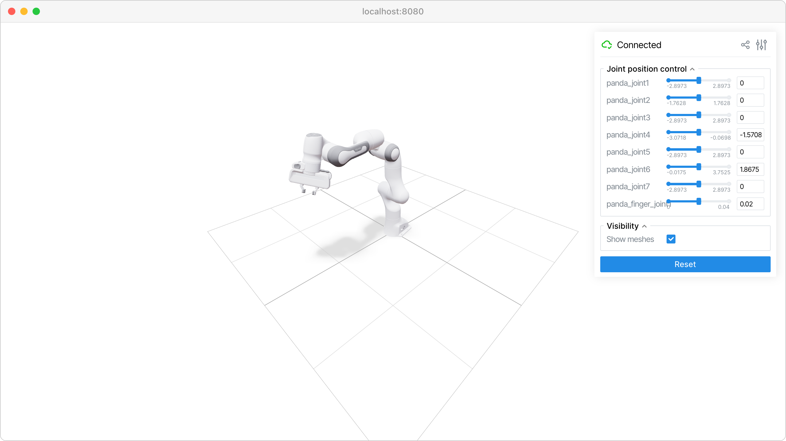

URDF robot visualizer
=====================

Visualize robot models from URDF files with interactive joint controls.

Requires yourdfpy and robot_descriptions. Any URDF supported by yourdfpy should work.

- https://github.com/robot-descriptions/robot_descriptions.py
- https://github.com/clemense/yourdfpy

**Features:**

* :class:`viser.extras.ViserUrdf` for URDF file parsing and visualization
* Interactive joint sliders for robot articulation
* Real-time robot pose updates
* Support for local URDF files and robot_descriptions library

**Source:** ``examples/04_demos/02_urdf_visualizer.py``

Code
----

.. code-block:: python
   :linenos:

   from __future__ import annotations
   
   import time
   from typing import Literal
   
   import numpy as np
   import tyro
   from robot_descriptions.loaders.yourdfpy import load_robot_description
   
   import viser
   from viser.extras import ViserUrdf
   
   
   def create_robot_control_sliders(
       server: viser.ViserServer, viser_urdf: ViserUrdf
   ) -> tuple[list[viser.GuiInputHandle[float]], list[float]]:
       slider_handles: list[viser.GuiInputHandle[float]] = []
       initial_config: list[float] = []
       for joint_name, (
           lower,
           upper,
       ) in viser_urdf.get_actuated_joint_limits().items():
           lower = lower if lower is not None else -np.pi
           upper = upper if upper is not None else np.pi
           initial_pos = 0.0 if lower < -0.1 and upper > 0.1 else (lower + upper) / 2.0
           slider = server.gui.add_slider(
               label=joint_name,
               min=lower,
               max=upper,
               step=1e-3,
               initial_value=initial_pos,
           )
           slider.on_update(  # When sliders move, we update the URDF configuration.
               lambda _: viser_urdf.update_cfg(
                   np.array([slider.value for slider in slider_handles])
               )
           )
           slider_handles.append(slider)
           initial_config.append(initial_pos)
       return slider_handles, initial_config
   
   
   def main(
       robot_type: Literal[
           "panda",
           "ur10",
           "cassie",
           "allegro_hand",
           "barrett_hand",
           "robotiq_2f85",
           "atlas_drc",
           "g1",
           "h1",
           "anymal_c",
           "go2",
       ] = "panda",
       load_meshes: bool = True,
       load_collision_meshes: bool = False,
   ) -> None:
       # Start viser server.
       server = viser.ViserServer()
   
       # Load URDF.
       #
       # This takes either a yourdfpy.URDF object or a path to a .urdf file.
       urdf = load_robot_description(
           robot_type + "_description",
           load_meshes=load_meshes,
           build_scene_graph=load_meshes,
           load_collision_meshes=load_collision_meshes,
           build_collision_scene_graph=load_collision_meshes,
       )
       viser_urdf = ViserUrdf(
           server,
           urdf_or_path=urdf,
           load_meshes=load_meshes,
           load_collision_meshes=load_collision_meshes,
           collision_mesh_color_override=(1.0, 0.0, 0.0, 0.5),
       )
   
       # Create sliders in GUI that help us move the robot joints.
       with server.gui.add_folder("Joint position control"):
           (slider_handles, initial_config) = create_robot_control_sliders(
               server, viser_urdf
           )
   
       # Add visibility checkboxes.
       with server.gui.add_folder("Visibility"):
           show_meshes_cb = server.gui.add_checkbox(
               "Show meshes",
               viser_urdf.show_visual,
           )
           show_collision_meshes_cb = server.gui.add_checkbox(
               "Show collision meshes", viser_urdf.show_collision
           )
   
       @show_meshes_cb.on_update
       def _(_):
           viser_urdf.show_visual = show_meshes_cb.value
   
       @show_collision_meshes_cb.on_update
       def _(_):
           viser_urdf.show_collision = show_collision_meshes_cb.value
   
       # Hide checkboxes if meshes are not loaded.
       show_meshes_cb.visible = load_meshes
       show_collision_meshes_cb.visible = load_collision_meshes
   
       # Set initial robot configuration.
       viser_urdf.update_cfg(np.array(initial_config))
   
       # Create grid.
       trimesh_scene = viser_urdf._urdf.scene or viser_urdf._urdf.collision_scene
       server.scene.add_grid(
           "/grid",
           width=2,
           height=2,
           position=(
               0.0,
               0.0,
               # Get the minimum z value of the trimesh scene.
               trimesh_scene.bounds[0, 2] if trimesh_scene is not None else 0.0,
           ),
       )
   
       # Create joint reset button.
       reset_button = server.gui.add_button("Reset")
   
       @reset_button.on_click
       def _(_):
           for s, init_q in zip(slider_handles, initial_config):
               s.value = init_q
   
       # Sleep forever.
       while True:
           time.sleep(10.0)
   
   
   if __name__ == "__main__":
       tyro.cli(main)
   
