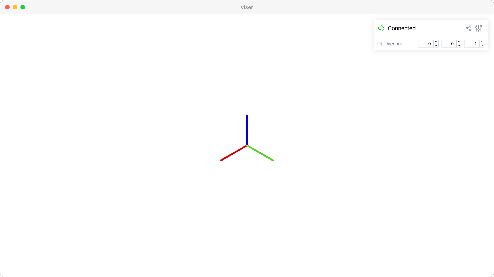

Set up direction
================

Control the global up direction for camera navigation and scene orientation.

**Features:**

* :meth:`viser.CameraHandle.set_up_direction` for camera orientation
* Interactive up vector control with GUI sliders
* Real-time camera constraint updates
* World axes visualization for reference

**Source:** ``examples/01_scene/08_set_up_direction.py``

Code
----

.. code-block:: python
   :linenos:

   import time
   
   import viser
   
   
   def main() -> None:
       server = viser.ViserServer()
       server.scene.world_axes.visible = True
       gui_up = server.gui.add_vector3(
           "Up Direction",
           initial_value=(0.0, 0.0, 1.0),
           step=0.01,
       )
   
       @gui_up.on_update
       def _(_) -> None:
           server.scene.set_up_direction(gui_up.value)
   
       while True:
           time.sleep(1.0)
   
   
   if __name__ == "__main__":
       main()
   
